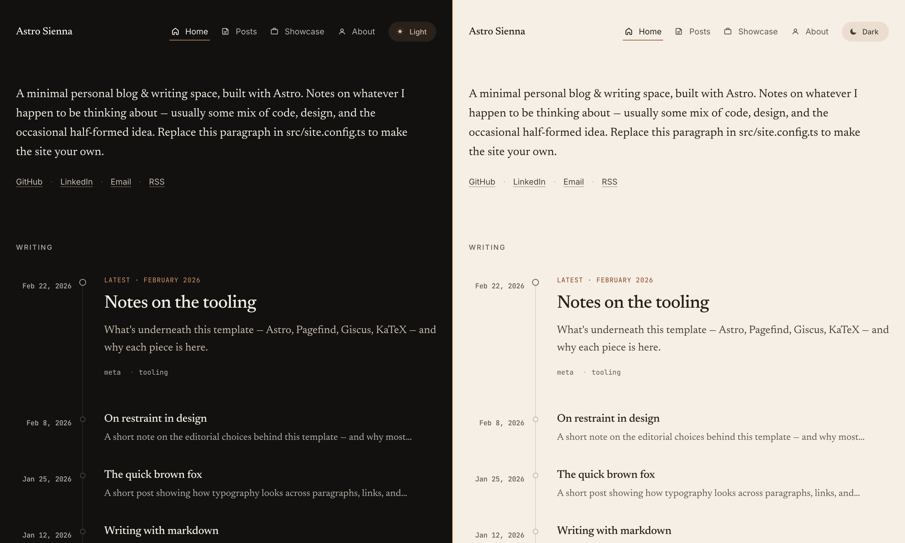

# Astro Sienna

A minimal Astro blog template with serif typography, dark mode, RSS, OG images, and optional Giscus comments and
analytics.

**Live demo:** [Github Pages](https://anjaygoel.github.io/astro-sienna)



## Features

- Astro 6 with content collections (posts and pages, both validated by Zod)
- MDX support — embed Astro/JSX components, imports, and JS expressions inside posts
- Light and dark mode with a CSS-only theme toggle
- Self-hosted serif body font ([Newsreader](https://github.com/productiontype/Newsreader)) and mono (JetBrains Mono)
- Code blocks via [astro-expressive-code](https://expressive-code.com): themes, copy button, terminal frames, line
  highlighting
- Math via KaTeX (`$inline$` and `$$display$$`)
- Custom containers (`:::note`, `:::tip`, `:::caution`)
- Per-post OG images generated at build time (Satori + resvg)
- RSS feed, sitemap, robots.txt, web manifest
- Optional [Giscus](https://giscus.app) comments with custom matched themes
- Optional GA4 and Goatcounter analytics, both loaded via [Partytown](https://partytown.qwik.dev/) so they run on a
  worker thread
- Optional [webmentions](https://webmention.io), fetched at build and cached locally
- Perfect Lighthouse scores (Performance, Accessibility, Best Practices, SEO)

## Quick start

Click **Use this template** on GitHub, or clone directly:

```sh
git clone https://github.com/AnjayGoel/astro-sienna.git my-site
cd my-site
pnpm install
pnpm dev
```

Open http://localhost:4321.

## Commands

| Command        | What it does                                 |
|----------------|----------------------------------------------|
| `pnpm dev`     | Start the dev server with HMR                |
| `pnpm build`   | Type-check, build, and run Pagefind indexing |
| `pnpm preview` | Preview the production build locally         |
| `pnpm format`  | Run Biome and Prettier                       |
| `pnpm lint`    | Lint with Biome                              |

## Configuration

Most personalisation happens in two files.

**`src/site.config.ts`** holds author, profile, comments, analytics, and webmentions. Every field in `profile` is
optional. Leave any of `email`, `github`, `linkedin`, `employer`, `alumni`, or `avatar` undefined and the corresponding
link is hidden site-wide. Same for `comments` and `analytics`: undefined means the script never loads.

**`astro.config.ts`** is where you set `site` to your final domain (used for canonical URLs, sitemap, RSS, and OG image
URLs). The base path is handled automatically — see [Deploying](#deploying); you normally don't touch it.

Replace these assets in `public/`:

- `icon.png` (512×512). Drives the favicon and the auto-generated `apple-touch-icon`, `icon-192`, and `icon-512` PWA
  manifest icons.
- `social-card.png` (1200×630). Fallback OG image, used when a post doesn't have its own. The default is a placeholder
  you can swap.
- `avatar.png` (optional). Referenced from `siteConfig.profile.avatar`, used in the About page's structured data and any
  avatar slot you add.

### Per-post OG images

Every post gets its own 1200×630 OG image generated at build time by [Satori](https://github.com/vercel/satori). The
markup lives in `src/pages/og-image/[...slug].png.ts`. Tweak it once and every post's card updates on the next build. To
skip the generated image and point a post at your own, set `ogImage: "/path/to/image.png"` in the post's frontmatter.

## Writing posts

Posts live in `src/content/post/` as `.md` or `.mdx` files. The filename becomes the slug.

```yaml
---
title: "Your post title"
publishDate: 2026-01-12
description: "One-sentence summary used in cards, social previews, and meta tags."
tags: [ tag-one, tag-two ]
# updatedDate: 2026-02-01     # optional, shown as "Updated …"
# draft: true                  # excludes the post from production builds
# coverImage:
#   src: ./_assets/cover.png
#   alt: "Description for screen readers"
---
```

The about page is also markdown, at `src/content/page/about.md`. Showcase entries are typed objects in
`src/data/showcase.ts`; empty the array and the Showcase tab is hidden automatically.

## Project layout

```
src/
  site.config.ts        # author / profile / integrations
  content.config.ts     # collection schemas (post, page)
  content/
    post/*.md           # blog posts
    page/about.md       # about page
  data/showcase.ts      # showcase entries (or empty for none)
  components/           # blog/, layout/, ui/
  layouts/              # Base.astro, BlogPost.astro
  pages/                # routes (incl. /og-image, /posts pagination, rss)
  plugins/              # remark-admonitions, remark-reading-time
  styles/global.css     # design tokens and shared utilities
public/                 # static assets served at site root
```

## Theming

Design tokens are CSS variables at the top of `src/styles/global.css`: accent colour, hairlines, surfaces, fonts. The
light and dark variants are gated by `[data-theme="light"]` and `[data-theme="dark"]` on the `<html>` element, so
swapping them is a single re-render with no script.

Code-block themes are configured separately in `expressiveCodeOptions` in `site.config.ts` (defaults: `min-light` and
`min-dark`).

## Deploying

Output is a static `dist/` directory that deploys anywhere serving files: Cloudflare Pages, Netlify, Vercel, GitHub
Pages, S3 + CloudFront. Build command: `pnpm build`. Output directory: `dist`.

### Base path

Defaults to root (`/`) — no config needed for local dev, Netlify, Vercel, Cloudflare Pages, a custom domain, or a
GitHub Pages **user** site. The whole site (links, assets, feeds, OG/canonical, manifest, Markdown links) is base-aware.

For a GitHub Pages **project** site (served from `/repo/`), the bundled `.github/workflows/deploy.yml` detects the
subpath and configures it automatically; the only manual step is **Settings → Pages → Source: GitHub Actions**. For a
subpath on any other host, build with `BASE_PATH=/sub pnpm build`.

## Pulling theme updates

To keep tracking upstream changes after you've forked, add this repo as a second remote:

```sh
git remote add theme https://github.com/AnjayGoel/astro-sienna.git
git fetch theme
git merge theme/main --allow-unrelated-histories
```

Use `.gitattributes` with a `merge=ours` driver on personal-content paths (e.g. `src/content/post/*`,
`src/site.config.ts`, `public/avatar.png`) to keep your changes through the merge.

## Credits

Originally forked from [astro-theme-cactus](https://github.com/chrismwilliams/astro-theme-cactus)
by [Chris Williams](https://github.com/chrismwilliams), then heavily revamped into its current form.

## License

[MIT](./LICENSE).
